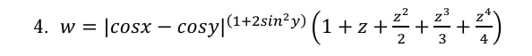
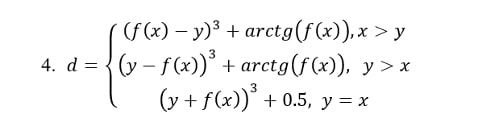
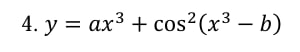

# Практическая работа №4 — Тестирование "белым ящиком"

**Дисциплина:** Поддержка и тестирование программных модулей 

**Цель работы:** Приобрести практические навыки ручного тестирования методом «белого ящика».

**Разработчики:**  
Журихин Руслан (3ИСИП-523)

**Вариант задания:** 4

**Формулы функций:**

| № | Функция | Скриншот формулы |
|---|---------|------------------|
| 1 | w = \|cos x − cos y\| ^ (1 + 2 sin² y) · (1 + z + z²/2 + z³/3 + z⁴/4) | |
| 2 | d = {(f(x) − y)³ + arctg(f(x)), x > y ; (y − f(x))³ + arctg(f(x)), y > x ; (y + f(x))³ + 0.5, x = y} <br> f(x) ∈ {sh(x), x², e^x} |  |
| 3 | y = a x³ + cos²(x³ − b) |  |

Реализованы три страницы с вводом данных, вычислением, выводом результата и подтверждением выхода.  
Проект загружен в публичный репозиторий Git.

---
## Функциональные возможности

### Страница 1
- Ввод: x, y, z
- Формула:  
  w = |cos x − cos y| ^ (1 + 2 sin² y) · (1 + z + z²/2 + z³/3 + z⁴/4)
- Вывод результата
- Кнопки: Вычислить / Очистить
- Отображение формулы (скриншот)

### Страница 2
- Ввод: x, y
- Выбор функции f(x): sh(x) / x² / e^x
- Кусочно-заданная функция d:
  - x > y: (f(x) − y)³ + arctg(f(x))
  - y > x: (y − f(x))³ + arctg(f(x))
  - x = y: (y + f(x))³ + 0.5
- Вывод результата
- Кнопки: Вычислить / Очистить

### Страница 3 — y = a x³ + cos²(x³ − b)
- Ввод: a, b, x₀, xₖ, dx
- Вычисление таблицы значений y(x) на отрезке [x₀ … xₖ] с шагом dx
- Построение графика функции (WindowsFormsHost + Chart)
- Кнопки: Вычислить и построить / Очистить

### Общие возможности
- Навигация по страницам через TabControl
- Подтверждение выхода из приложения (MessageBox)
- Валидация ввода (TryParse, проверка dx ≠ 0)
- ToolTip'ы на элементах
- Очистка полей ввода и результатов

---
## Технологии
- **WPF (.NET Framework)** — пользовательский интерфейс
- **System.Windows.Forms.DataVisualization.Charting** — построение графика (WindowsFormsHost)
- **Git** — система контроля версий
- **Markdown** — оформление документации (README.md)

---
## Структура проекта
```
Zhurikhin_523/
├─ Pages/
│ ├─ Page1.xaml             
│ ├─ Page1.xaml.cs
│ ├─ Page2.xaml             
│ ├─ Page2.xaml.cs
│ ├─ Page3.xaml               
│ └─ Page3.xaml.cs
├─ Images/
│ ├─ formula_1.jpg         
│ ├─ formula_2.jpg         
│ └─ formula_3.jpg       
├─ MainWindow.xaml
├─ MainWindow.xaml.cs
└─ README.md
```
---
## Запуск и использование
1. Открыть решение в Visual Studio 2022 (или новее)
2. Убедиться, что установлены:
   - .NET Framework
   - NuGet-пакет System.Windows.Forms.DataVisualization (для графика)
3. Собрать проект (Build → Build Solution)
4. Запустить (F5)

При первом запуске:
- Проверить, что изображения формул находятся в папке Images
- Убедиться, что WindowsFormsHost отображается корректно

---
