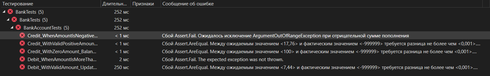

# Практическая работа №6 — Создание автоматизированных unit-тестов  
**Часть 1**  
**Дисциплина:** Поддержка и тестирование программных модулей  
**Цель работы:** Освоить создание и запуск автоматизированных модульных тестов методом «белого ящика» в Microsoft Visual Studio с использованием MSTest. Научиться документировать код с помощью XML-комментариев.  
**Разработчик:**  
Журихин Руслан (3ИСИП-523)  

Проект загружен в удалённый репозиторий Git.

---
## Реализованные тесты (5 шт.)

| № | Название теста                                              | Что проверяет                                      | Ожидаемый результат                                  |
|---|-------------------------------------------------------------|----------------------------------------------------|------------------------------------------------------|
| 1 | Debit_WithValidAmount_UpdatesBalance                        | Корректное списание суммы ≤ баланса                | Баланс уменьшается на величину amount                |
| 2 | Debit_WhenAmountIsMoreThanBalance_ShouldThrow...            | Списание суммы > текущего баланса                  | Выбрасывается ArgumentOutOfRangeException            |
| 3 | Credit_WithValidPositiveAmount_IncreasesBalance             | Пополнение положительной суммой                    | Баланс увеличивается на величину amount              |
| 4 | Credit_WhenAmountIsNegative_ShouldThrow...                  | Попытка пополнения отрицательной суммой            | Выбрасывается ArgumentOutOfRangeException            |
| 5 | Credit_WithZeroAmount_BalanceShouldNotChange                | Пополнение на 0 рублей                             | Баланс остаётся без изменений                        |

*Примечание: также проверялся сценарий Debit с отрицательной суммой (отдельный скриншот).*

---
## Технологии
- **C#**  
- **.NET** (версия, выбранная при создании проекта)  
- **MSTest** — фреймворк модульного тестирования  
- **Microsoft Visual Studio**  
- **Git** — контроль версий  
- **Markdown** — оформление отчёта

---
## Структура проекта
```
Zhurikhin_523/
├─ Bank/
│  └─ BankAccount.cs
├─ BankTests/
│  ├─ BankAccountTests.cs
│  └─ Images/
│     ├─ AllFail.png
│     ├─ AllPass.png
│     ├─ Credit_WhenAmountIsNegative_ShouldThrowArgumentOutOfRangeExceptionPass.png
│     ├─ Credit_WithValidPositiveAmount_IncreasesBalancePass.png
│     ├─ Credit_WithZeroAmount_BalanceShouldNotChangePass.png
│     ├─ Debit_WhenAmountIsLessThanZero_ShouldThrowArgumentOutOfRangePass.png
│     ├─ Debit_WhenAmountIsMoreThanBalance_ShouldThrowArgumentOutOfRangePass.png
│     ├─ Debit_WithValidAmount_UpdatesBalanceFail.png
│     ├─ Debit_WithValidAmount_UpdatesBalancePass.png
│     └─ FinalDebit_WhenAmountIsMoreThanBalance_ShouldThrowArgumentOutOfRangePass.png
└─ README.md
```

---
## Скриншоты результатов

**Успешное прохождение всех тестов**  
  
*Обозреватель тестов — 5/5 зелёных*

**Намеренное внесение ошибки → все тесты провалены**  
  
*Страшный красный цвет*

**Успешное выполнение отдельных тестов**

- Debit — корректное списание  


- Debit — попытка снять больше баланса  


- Debit — финальная версия теста на превышение баланса  


- Debit — попытка снять отрицательную сумму  


- Credit — корректное пополнение  


- Credit — отрицательная сумма  


- Credit — пополнение на 0  


**Пример провала теста (Debit — некорректное списание)**  


---
## Выводы по работе

- Написаны и проверены 5 модульных тестов, покрывающих основные сценарии методов `Debit` и `Credit`.
- Тесты успешно выявили ошибку в исходной реализации метода `Debit` (операция `+=` вместо `-=`).
- После исправления кода и рефакторинга (добавление информативных сообщений в исключения) все тесты проходят успешно.
