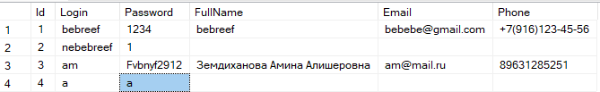
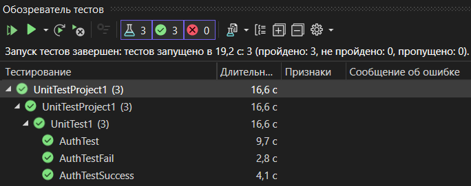
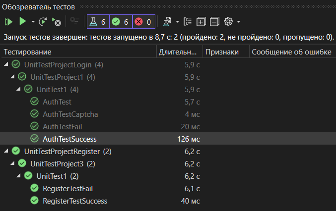

# Практическая работа №6 — Создание автоматизированных unit-тестов (Часть 3)

**Дисциплина:** Поддержка и тестирование программных модулей  
**Цель работы:** Провести тестирование разработанных программных модулей с использованием средств автоматизации Microsoft Visual Studio методом «белого ящика».

**Разработчик:** Журихин Руслан 3ИСИП-523

Проект основан на WPF-приложении из Практической работы №14 «Разработка программных модулей».  
В рамках ПР6 проведён рефакторинг модулей авторизации и регистрации, добавлена простейшая CAPTCHA после трёх неудачных попыток входа, созданы два тестовых проекта и разработан полный набор модульных тестов (MSTest).

Проект загружен в публичный репозиторий Git.

---

## Скриншот содержимого таблицы пользователей (Microsoft SQL Server)



---

## Структура проекта
```
Zhurikhin_523
├─ Pr14 (основной WPF-проект)
│   ├─ Pages
│   │   ├─ LoginPage.xaml
│   │   ├─ LoginPage.xaml.cs          ← рефакторинг + CAPTCHA
│   │   ├─ RegisterPage.xaml
│   │   └─ RegisterPage.xaml.cs       ← рефакторинг
│   ├─ App.config
│   └─ ...
│
├─ UnitTestProject1               ← тесты авторизации
│   └─ UnitTest1.cs
│
├─ UnitTestProject3            ← тесты регистрации 
│   └─ UnitTest1.cs
│
└─ README.md
```

---

## Проделанная работа

### 1. Рефакторинг модуля авторизации (`LoginPage`)
- Создан публичный метод `bool Auth(string login, string password, string captchaInput = "", bool showMessages = true)`
- Вся логика (проверка пустых полей, счётчик неудачных попыток, CAPTCHA, поиск пользователя в БД, установка `CurrentUser`) перенесена в этот метод.
- Обработчик кнопки `btnLogin_Click` теперь содержит только вызов `Auth(...)`.
- Реализована простейшая CAPTCHA (6 случайных символов), которая появляется после 3 неудачных попыток.
- Добавлены вспомогательные методы: `GenerateCaptcha()`, `GetCurrentCaptcha()`, `ResetFailedAttempts()`.

### 2. Рефакторинг модуля регистрации (`RegisterPage`)
- Создан публичный метод `bool Register(...)` с поддержкой `showMessages`.
- Логика проверки обязательных полей и уникальности логина вынесена в метод.
- Обработчик кнопки регистрации теперь только вызывает `Register(...)`.

### 3. Модульное тестирование авторизации (`UnitTestProjectLogin`)

#### Таблица тестов авторизации

| Название теста         | Что проверяет                                                                 | Ожидаемый результат                          | Статус  | Примечание |
|------------------------|-------------------------------------------------------------------------------|----------------------------------------------|---------|------------|
| AuthTest              | Неверный логин и пароль                                                       | `false`                                     | Passed | Базовый негативный тест |
| AuthTestSuccess       | Успешная авторизация всеми пользователями из БД                               | `true` для каждого пользователя             | Passed | Позитивные сценарии |
| AuthTestFail          | Пустые поля, несуществующий пользователь, неверный пароль                     | `false`                                     | Passed | Негативные сценарии из ПР3 |
| AuthTestCaptcha       | Работа CAPTCHA после 3 неудачных попыток                                      | `false` без капчи → `true` с правильной     | Passed | Бонусное задание |

**Описание работы тестов:**
- `AuthTest` — проверяет отказ при неверных данных.
- `AuthTestSuccess` — сбрасывает счётчик неудач и по очереди логинит всех реальных пользователей из базы.
- `AuthTestFail` — проверяет пустые поля, несуществующий логин и несколько неверных попыток.
- `AuthTestCaptcha` — имитирует 3 ошибки, затем проверяет, что без капчи вход невозможен, а с правильным кодом (полученным через `GetCurrentCaptcha()`) — успешен.



### 4. Модульное тестирование регистрации (`UnitTestProjectRegister`)

#### Таблица тестов регистрации

| Название теста            | Что проверяет                                                      | Ожидаемый результат                  | Статус | Примечание |
|---------------------------|--------------------------------------------------------------------|--------------------------------------|--------|------------|
| RegisterTestSuccess      | Успешная регистрация с уникальным логином                         | `true`                              | Passed | Генерируется новый логин |
| RegisterTestFail         | Пустые обязательные поля и попытка использовать занятый логин     | `false` / `true` (с Trim)           | Passed | Негативные сценарии из ПР3 |

**Описание работы тестов:**
- `RegisterTestSuccess` — создаёт пользователя с уникальным логином через `Guid`.
- `RegisterTestFail` — проверяет отказ при пустых полях и при дублировании существующего логина.

**Общий результат выполнения тестов:**  
Все тесты пройдены успешно (Passed: 6 / Failed: 0).



---

## Вывод по проведённому тестированию

Автоматизированное unit-тестирование модулей авторизации и регистрации выполнено успешно методом «белого ящика».

**Причины успешного выполнения всех тестов:**
- Проведён рефакторинг: вся бизнес-логика вынесена в отдельные методы `Auth()` и `Register()`, не зависящие от UI.
- В тестах используется `showMessages: false`, благодаря чему MessageBox не блокируют выполнение.
- Для подключения к базе данных в тестовые проекты скопирован `App.config` и добавлены необходимые сборки Entity Framework.
- CAPTCHA корректно включается после трёх неудачных попыток и полноценно протестирована.
- Позитивные тесты используют реальные данные из БД, негативные — полностью покрывают краевые случаи и ошибки, описанные в ПР3.
- Все основные ветки кода (успех, различные виды ошибок, механизм CAPTCHA) покрыты тестами.
