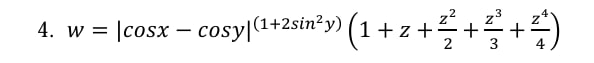
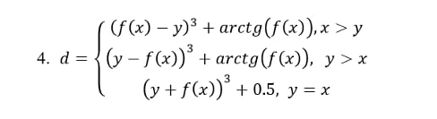
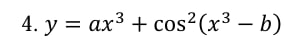
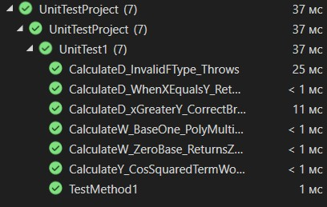

# Практическая работа №6 — Создание автоматизированных unit-тестов (Часть 2)
**Дисциплина:** Поддержка и тестирование программных модулей  
**Цель работы:** Провести тестирование разработанных программных модулей с использованием средств автоматизации Microsoft Visual Studio методом «белого ящика».  
**Разработчик:** Журихин Руслан (3ИСИП-523)  

Проект основан на WPF-приложении из Практической работы №4.  
В рамках ПР6 проведён рефакторинг кода, добавлены XML-документирующие комментарии и разработан набор модульных тестов.

Проект загружен в публичный репозиторий Git.

---

## Формулы функций (из ПР4)

| № | Функция                                                                 | Скриншот формулы                                                                 |
|---|-------------------------------------------------------------------------|----------------------------------------------------------------------------------|
| 1 | w = \|cos x − cos y\|^(1 + 2 sin² y) · (1 + z + z²/2 + z³/3 + z⁴/4)   |                                 |
| 2 | d = {(f(x)−y)³ + arctg(f(x)), x>y ; (y−f(x))³ + arctg(f(x)), y>x ; (y+f(x))³ + 0.5, x=y} <br> f(x) ∈ {sh(x), x², e^x} |                                 |
| 3 | y = a · x³ + cos²(x³ − b)                                               |                                 |

---

## Структура проекта
```
Zhurikhin_523
├─ UnitTestProject
│   ├─ UnitTest1.cs
└─ Zhurikhin_523
├─ Images
│   ├─ formula_1.jpg
│   ├─ formula_2.jpg
│   ├─ formula_3.jpg
│   ├─ AllPass.jpg
├─ Pages
│   ├─ Page1.xaml
│   ├─ Page1.xaml.cs
│   ├─ Page2.xaml
│   ├─ Page2.xaml.cs
│   ├─ Page3.xaml
│   └─ Page3.xaml.cs
├─ MainWindow.xaml
├─ MainWindow.xaml.cs
├─ MathFunctions.cs
└─ README.md
```

---

## Проделанная работа

### 1. Рефакторинг кода

- Все математические вычисления вынесены в отдельный статический класс `MathFunctions.cs` (без зависимостей от WPF/UI).
- На каждой странице логика вычислений вынесена в отдельные методы, возвращающие `bool` (успех/неуспех):
  - `CalculateW(...)` — вкладка φ (Page1)
  - `CalculateD(...)` — вкладка j (Page2)
  - `CalculateAndPlot(...)` — вкладка «Таблица и график» (Page3)
- Обработчики кнопок «Вычислить» содержат только:
  - проверку ввода (TryParse)
  - вызов метода расчёта
  - вывод результата или сообщения об ошибке

### 2. Документирование кода

- Добавлены XML-комментарии:
  - ко всем методам-обработчикам кнопок (`BtnCalc_Click`, `BtnCalculate_Click`)
  - к методам расчёта на страницах
  - ко всем методам класса `MathFunctions`

### 3. Модульное тестирование

- Создан тестовый проект `UnitTestProject` (MSTest)
- Добавлена ссылка на основной проект
- Разработано 7 тестов (1 тренировочный + 6 целевых)

#### Таблица тестов

| Название теста                                   | Что проверяет                                                                | Ожидаемый результат                  | Статус   | Примечание                                      |
|--------------------------------------------------|------------------------------------------------------------------------------|--------------------------------------|----------|-------------------------------------------------|
| TestMethod1                                      | Тренировочный тест (пример использования Assert)                             | Все проверки проходят                | Passed   | Проверка различных методов Assert               |
| CalculateW_ZeroBase_ReturnsZero                  | w при x=0, y=0 → база = 0 → результат = 0                                    | 0.0                                  | Passed   | Проверка нулевой базы                           |
| CalculateW_BaseOne_PolyMultiplied                | w при x=0, y=π, z=0 → база = 2, степень = 1, полином = 1                     | 2.0                                  | Passed   | Проверка ненулевой базы                         |
| CalculateD_WhenXEqualsY_ReturnsCorrectValue      | Ветка x == y для f = sinh(x=4.0) — (y + f)³ + 0.5                            | ~30635.173                           | Passed   | Исправлен после отладки                         |
| CalculateD_xGreaterY_CorrectBranch               | Ветка x > y (x=3, y=1, f=sinh) — (f - y)³ + atan(f)                          | правильное численное значение        | Passed   | Проверка основной ветки логики                  |
| CalculateY_CosSquaredTermWorks                   | y = a·x³ + cos²(x³−b) при x=1, a=2, b=0                                      | 2 + cos²(1)                          | Passed   | Проверка формулы целиком                        |
| CalculateD_InvalidFType_Throws                   | Выбрасывание исключения при неизвестном fType                                | ArgumentException                    | Passed   | Проверка обработки ошибок                       |

**Результаты выполнения тестов:**  
Все тесты успешно пройдены (Passed: 7 / Failed: 0).



---

## Вывод по проведённому тестированию

Автоматизированное тестирование трёх математических функций выполнено успешно.  
Все 7 разработанных тестов пройдены без ошибок.

**Причины успешного выполнения:**
- Функции полностью изолированы в классе `MathFunctions` — нет зависимостей от UI.
- Логика страниц вынесена в отдельные методы с возвратом признака успеха.
- Тесты покрывают основные ветви логики, краевые случаи и обработку ошибок.
- Точность сравнения выбрана адекватно для double (1e-8 – 1e-10).
