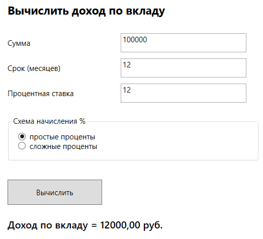
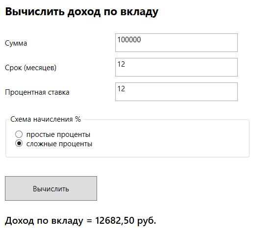
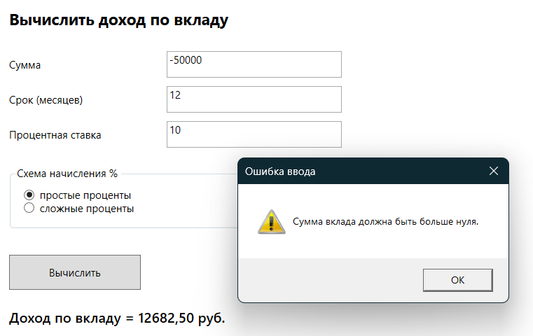
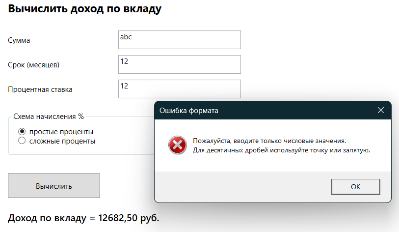
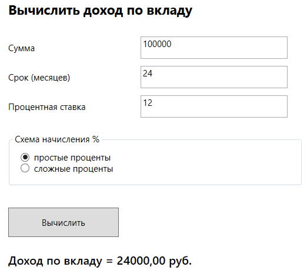
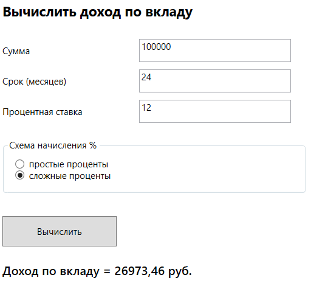
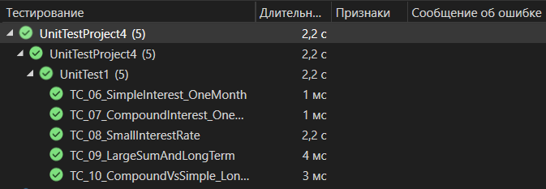

# Текущий контроль — Калькулятор дохода по вкладу (Вариант №4)

**Дисциплина:** Поддержка и тестирование программных модулей  
**Студент:** Журихин Руслан (3ИСИП-523)  
**Дата:** 02.04.2026

Проект загружен в удалённый репозиторий Git.

---

## Описание проекта
Разработано WPF-приложение для расчёта дохода по банковскому вкладу с двумя схемами начисления процентов:
- **Простые проценты**
- **Сложные проценты** 

Приложение содержит валидацию входных данных и подробные XML-комментарии в коде.

---

## Выполненные задачи
- Разработано WPF-приложение (C# + XAML)
- Добавлены подробные **XML-комментарии**
- Проведено **ручное тестирование** (TC_01 – TC_05)
- Разработаны и запущены **автоматизированные unit-тесты** (TC_06 – TC_10) 
- Результаты тестирования задокументированы
- Проект загружен в Git

---

## Тестовые сценарии

### Ручное тестирование (TC_01 – TC_05)

| №   | ID теста | Название теста                                      | Что проверяет                                      | Ожидаемый результат                          |
|-----|----------|-----------------------------------------------------|----------------------------------------------------|----------------------------------------------|
| 1   | TC_01    | Расчёт дохода при простых процентах                 | Корректность расчёта простых процентов            | Доход = 12000.00 руб.                        |
| 2   | TC_02    | Расчёт дохода при сложных процентах                 | Корректность расчёта сложных процентов            | Доход ≈ 12682.50 руб.                        |
| 3   | TC_03    | Валидация отрицательных и нулевых значений          | Обработка некорректных данных                     | Сообщение об ошибке                          |
| 4   | TC_04    | Обработка некорректного ввода (буквы вместо цифр)   | Устойчивость к нечисловому вводу                  | Сообщение об ошибке формата                  |
| 5   | TC_05    | Сравнение простых и сложных процентов               | Сложные % дают больший доход при сроке > 1 мес.   | Сложные > Простые                            |

**Скриншоты успешного ручного тестирования:**
- 
- 
- 
- 
-   
  

### Автоматизированное тестирование (TC_06 – TC_10)

| №   | ID теста | Название теста                                      | Что проверяет                                           | Ожидаемый результат                              |
|-----|----------|-----------------------------------------------------|---------------------------------------------------------|--------------------------------------------------|
| 6   | TC_06    | Простые проценты при сроке 1 месяц                  | Расчёт простых процентов за 1 месяц                     | Доход = 1000.00 руб.                             |
| 7   | TC_07    | Сложные проценты при сроке 1 месяц                  | Расчёт сложных процентов за 1 месяц                     | Доход = 1000.00 руб.                             |
| 8   | TC_08    | Расчёт при маленькой процентной ставке              | Корректность расчёта при ставке 0.5%                    | Доход ≈ 125.13 руб.                              |
| 9   | TC_09    | Расчёт при большой сумме и длительном сроке         | Работа с большими значениями                            | Доход > 1 000 000 руб.                           |
| 10  | TC_10    | Сравнение простых и сложных процентов (длинный срок)| Сложные проценты дают больший доход при длительном сроке| Сложные % > Простые %                            |

**Скриншот Обозревателя тестов (Test Explorer):**


---

## Технологии и инструменты
- **C#** + **WPF**
- **.NET**
- **MSTest** — фреймворк для модульного тестирования
- **Visual Studio**
- **Git** + **GitHub/GitLab**
- **Microsoft Word** — документирование тест-кейсов
- **Markdown** — оформление README

---

## Структура проекта
```
Zhurikhin_523/
├── Zhurikhin_523/                
│   ├── MainWindow.xaml
│   ├── MainWindow.xaml.cs
│   └── Images
├── UnitTestProject4/          
│   └── UnitTest1.cs
└─ README.md
```

---

## Выводы
В ходе выполнения работы:
- Проведено как ручное, так и автоматизированное тестирование функциональности.
- Все тесты (ручные и автоматические - 10 тестовых сценариев) успешно пройдены.
- Все тесты успешно задокументированы в Word-файле.
